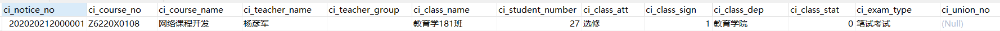
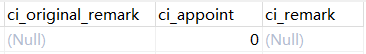
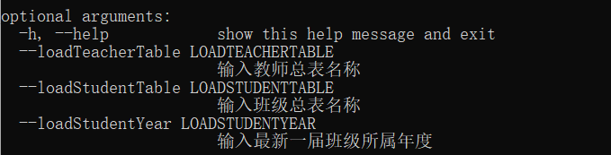
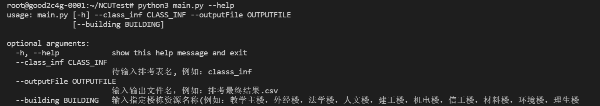
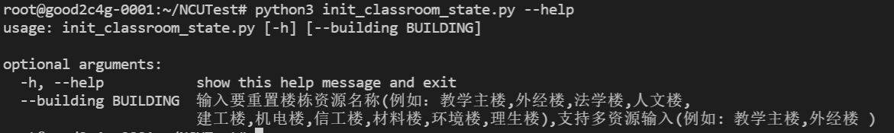
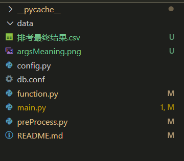
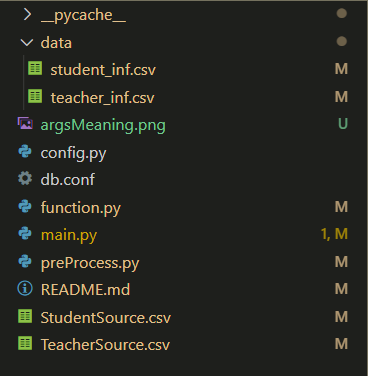
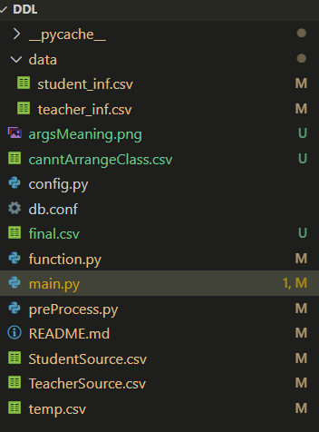
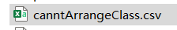
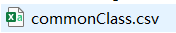

### 标准输入表

需要排课的输入表  必须满足 如图所示 不允许修改字段名称 

| **表名称**           | 待排考课程       | 每一行为一个整体，视作一个排考单元，不可再拆分。             |
| -------------------- | ---------------- | ------------------------------------------------------------ |
| **字段名称**         | **字段中文名称** | **示例**                                                     |
| ci_course_id         | 序号（主键       | 自增字段                                                     |
| ci_course_no         | 开课号           | 590GL005                                                     |
| ci_course_name       | 课名             | 工程制图（1）下                                              |
| ci_class_name        | 班级名           | 土木工程（建筑工程方向）[181-3]班,土木工程（地下工程方向）181班 |
| ci_student_number    | 学生数量         | 130                                                          |
| ci_class_dep         | 所属学院         | 教育学院                                                     |
| ci_exam_type         | 考试类型         | 笔试考试（上机考试，xx）                                     |
| ci_teacher_name      | 授课老师         | 李胜楠:王葳                                                  |
| ci_specify_teacher   | 指定老师         | xxx（默认为-1）                                              |
| ci_specify_time      | 指定时段         | 1（根据时段表，默认为-1）                                    |
| ci_sprcify_classroom | 指定区域         | 慧园楼（信工楼，建工，，默认为-1）                           |

数据库对应格式为：



	


 给出来的课表中学院名称必须为全称

```
'建筑工程学院', '其他', '外国语学院', '经济管理学院', '教务处', '法学院', '人文学院', '艺术与设计学院', '材料科学与工程学院', '招生与就业工作处（与毕业生就业指导服务中心合署）', '体育学院', '旅游学院', '软件学院', '研究生院（与党委研究生工作部合署）', '新闻与传播学院', '学生工作处（与学生工作委员会办公室合署)', '管理学院', '护理学院', '资源环境与化工学院', '信息工程学院', '前湖学院', '高等研究院', '马克思主义学院', '理学院', '机电工程学院', '食品学院', '人民武装部（与军事教学部合署）', '药学院', '生命科学学院', '基础医学院', '公共卫生学院', '第一临床医学院', '第二临床医学院', '眼视光学院', '第四临床医学院', '公共管理学院', '化学学院', '玛丽女王学院', '教育发展研究院', '医学部', '口腔医学院', '转化医学研究院', '心理健康教育中心', '校内科研单位', '人民临床医学院', '实验动物科学中心', '第三临床医学院', '未来技术学院', '测试学院', '儿科医学院', '双学位管理学院'
```

如：不允许出现“信工学院“，应该为“信息工程学院”，必须为以上学院名称之一


### 传参

先对数据初始化 初始化命令行参数含义如图所示

​	

主函数命令行参数含义如图所示，building 选项是除了主教以外，需要新增的楼栋资源。

初始化教室状态表，默认重置所有楼栋教室状态（慎用）。



**传参格式**

需要进行初始化的命令行

```shell
python3 preProcess.py --loadTeacherTable teacher_inf --loadStudentTable student_info --loadStudentYear 2020
```

或者直接采用默认设置

```shell
python3 preProcess.py
```

重置所有楼栋状态（默认）

```bash
python3 init_classroom_state.py 
```

重置指定楼栋状态（支持单多选，中间用英文逗号隔开。）

```
python3 init_classroom_state.py --building 教学主楼,信工楼
```

生成排考表的命令行 其中**classs_inf** 是数据库中的待排课表，**信工楼**是除主教外的额外资源。

```shell
python3 main.py --class_inf classs_inf --outputFile final.csv --building 信工楼
```

### 文件结构一览

	

**必须建立在当前文件夹下建立 data 文件夹**

初始化命令行之后 生成文件结构为

	

其中 TeacherSource.csv 和 StudentSource.csv 记录了教师和学生的状态

运行main.py 文件之后文件结构为

	

其中 canntArrangeClass.csv 记录了找不到合适教室的班级情况

### 示例

所有的结果数据都将上传到数据库中。

刚开始需要初始化，输入命令行 （默认加载全校老师和全部年级班级，但是算法会识别不同学院不同班级）

```shell
python3 preProcess.py --loadTeacherTable teacher_inf --loadStudentTable student_info --loadStudentYear 2020
```

或者使用默认设置

```
python3 preProcess.py
```

重置所有楼栋状态（默认）

```bash
python3 init_classroom_state.py 
```

或者重置指定楼栋状态（支持单多选，中间用英文逗号隔开。）

```
python3 init_classroom_state.py --building 教学主楼,信工楼
```

进行公共课排课，输入命令行

```shell
python3 main.py --class_inf commonClass --outputFile commonClass.csv --building 信工楼
```

其中无可用教室的写入文件（并上传同名文件到数据库中）（下图非唯一名称）

	

生成对应排课结果为（并上传同名文件到数据库中）（下图非唯一名称）

	

进行专业课排课，比如经管学院

```shell
python3 main.py --class_inf economy --outputFile economyClass.csv --building 外经楼
```

可再次进行专业课排课，比如信息工程学院

```shell
python3 main.py --class_inf informationEngineer --outputFile information.csv --building 信工楼
```
